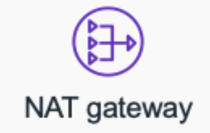

- AWSを学び,solution architectを取得したい。

    LINEの公式ビジネスアカウントAPIを活用したパーソナル広告の管理システムをdjangoで開発・運用させていただいた時に、ある程度EC2/RDS, Cloudwatch等触ったけど、ROUTE 53、NAT Gatewayの理解はまだ出来ていない。

- そこで、今日から週に1回ペースで、AWSのサービスを１個ずつ学んでいく。

# NATゲートウェイ

あるプライベートサブネットをインターネットからのアクセスを防ぎつつ、インターネット「への」アクセスをさせたい時、利用する機能

>そもそもNATとは？

- NAT: network address transformation
    - コンピュータネットワークにおいて、主にグローバルIPアドレスをプライベートIPアドレスに、またはその逆の変換を行う技術のこと
    - ルータやゲートウェイに搭載されている。

プライベートIPアドレスとグローバルIPアドレスを1:1で変換してくれるため、

## NATインスタンスとNATゲートウェイって何が違うの？
[まとめ](https://www.hatarakumama-pj.com/posts/ginzaitlab6907182/#:~:text=NAT%E3%82%B2%E3%83%BC%E3%83%88%E3%82%A6%E3%82%A7%E3%82%A4%E3%81%AF%E3%80%81Amazon%E5%81%B4,%E9%81%8B%E7%94%A8%E7%AE%A1%E7%90%86%E3%82%92%E8%A1%8C%E3%81%84%E3%81%BE%E3%81%99%E3%80%82)があったので、簡単に表にしてみました。
 
-|NATインスタンス|NATゲートウェイ
--|--|--
作成方法|Ec2インスタンスの設定|専用ページで設置
運用管理|人的管理|マネージドサービス

- あと料金体系も違う。後述

## 料金体系

- NATインスタンスの場合、元はEC2なので、インスタンスの使用期間、インスタンスタイプとサイズに応じて課金されます。
- NATゲートウェイの時間単位の使用料金とデータ処理料金が適用されます
- NATゲートウェイと EC2インスタンスが異なるアベイラビリティーゾーンにある場合**データ転送料金**が発生します
## その他注意点
- IGWにルーティングがあるパブリックサブネットにNATゲートウェイを設置しなければダメ

## おまけ
- 最新のiconはこちら。

     

## 具体的な設定方法

やはり公式を見るのが一番よね。

https://aws.amazon.com/jp/premiumsupport/knowledge-center/nat-gateway-vpc-private-subnet/

